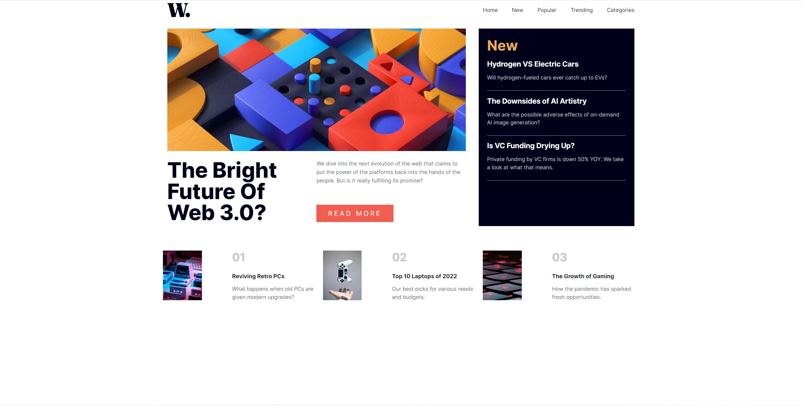

# news-homepage-challenge
 News homepage design challenge using react.

### The challenge

Users should be able to:

- View the optimal layout for the interface depending on their device's screen size
- See hover and focus states for all interactive elements on the page

### Screenshot

(./screenshot-mobile.jpg)(./screenshot-mobile-2.jpg)


### Links

- Solution URL: [Add solution URL here](https://your-solution-url.com)
- Live Site URL: [Add live site URL here](https://your-live-site-url.com)

## My process

### Built with

- Semantic HTML5 markup
- CSS custom properties
- Flexbox
- CSS Grid
- Mobile-first workflow
- [React](https://reactjs.org/) - JS library
- [Next.js](https://nextjs.org/) - React framework
- [Styled Components](https://styled-components.com/) - For styles

**Note: These are just examples. Delete this note and replace the list above with your own choices**

### What I learned

Here are recaps of what I've learned with this project:

```html
<ul>
    <li>React + typscript</li>
    <li>bootstrap + css variable</li>
    <li>Framer motion react</li>
</ul>
```


## Author
- Hongleang Lim
- Frontend Mentor - [@yourusername](https://www.frontendmentor.io/profile/yourusername)
- Twitter - [@yourusername](https://www.twitter.com/yourusername)


## Acknowledgments

Frontend mentor design
